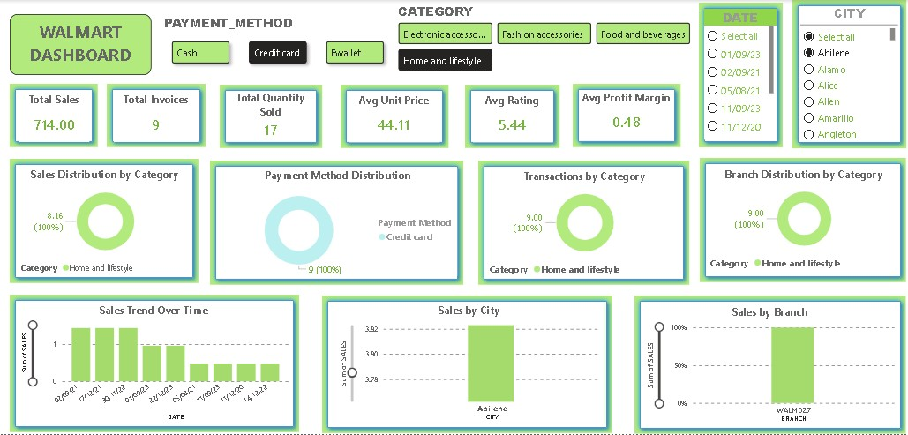

**🛒 Walmart Sales Analysis Dashboard**

**📖 Overview****

This project focuses on analyzing Walmart sales data using Python, SQL, and Power BI. The dataset was cleaned and prepared using Python, business questions were solved using SQL, and an interactive dashboard was built in Power BI to provide meaningful business insights.

**🎯 Project Objectives**

Analyze sales performance across branches and cities.
Identify top-performing product categories.
Study customer payment preferences.
Track sales trends over time.
Evaluate customer ratings and profit margins.
Build an interactive dashboard for business decision-making.

**🛠️ Tools & Technologies**

Python (Pandas) – Data Cleaning & Preprocessing
MySQL – Business Query Analysis
Power BI – Interactive Dashboard
Microsoft Excel – Dataset

**📊 Dashboard KPIs**

Total Sales
Total Invoices
Total Quantity Sold
Average Unit Price
Average Rating
Average Profit Margin

**📈 Dashboard Visuals**

**KPI Cards**

Total Sales
Total Invoices
Total Quantity Sold
Average Unit Price
Average Rating
Average Profit Margin

**Donut Charts**

Sales Distribution by Category
Payment Method Distribution
Transactions by Category
Branch Distribution by Category
Charts
Sales Trend Over Time
Sales by City
Sales by Branch

**Filters**

Payment Method
Category
Date
City

**Business Insights**

Identified the highest-selling product categories.
Compared sales performance across different branches and cities.
Analyzed customer payment method preferences.
Monitored sales trends over time.
Evaluated customer ratings and profit margins.

**🚀 Project Workflow**

Data Cleaning using Python
Business Analysis using SQL
Dashboard Development using Power BI
Business Insights Generation

**Dashboard Preview**

**📌 Skills Demonstrated**

Data Cleaning
SQL Query Writing
Data Visualization
Dashboard Design
Business Analysis
Power BI
Python
MySQL
Microsoft Excel

**👩‍💻 Author**

**Sehrish Sabir**
